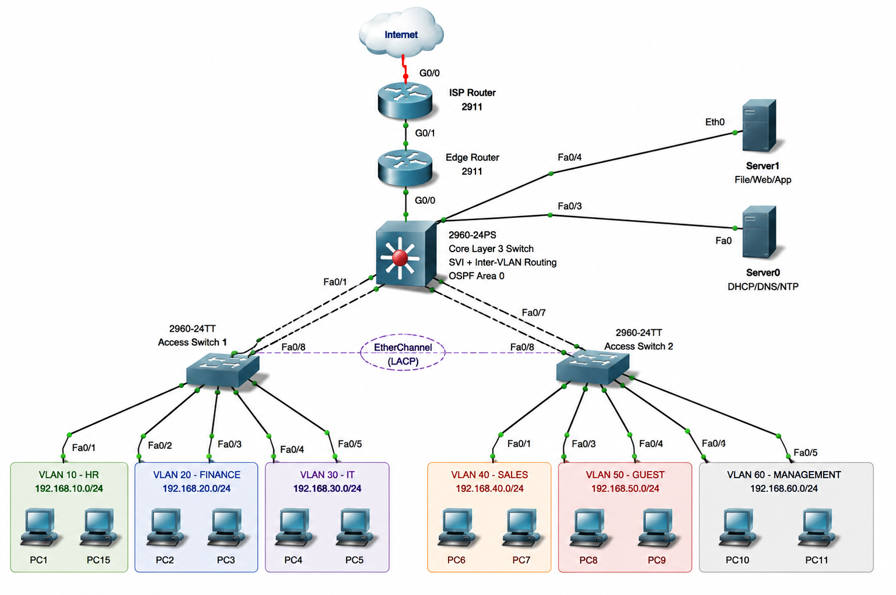

# 🏢 Enterprise Corporate Office Network

A complete enterprise corporate network designed and implemented using **Cisco Packet Tracer**.

## 📌 Project Overview

This project simulates a real-world corporate office network with multiple departments, centralized servers, secure management, dynamic routing, Internet access, and network security.

The network is designed using **VLAN segmentation, Inter-VLAN Routing, OSPF, DHCP, NAT/PAT, ACL, STP, EtherChannel, SSH, Port Security, DNS, and NTP**.

## 🌐 Network Topology

### Network Flow

**Internet → ISP Router → Edge Router → Core Layer-3 Switch → Access Switches → PCs**

The **Core Layer-3 Switch** also connects to the **Server VLAN**, which contains centralized network and application services.

## 🏢 VLAN & IP Addressing

| VLAN | Department | Network | Gateway |
|---:|---|---|---|
| 10 | HR | 192.168.10.0/24 | 192.168.10.1 |
| 20 | Finance | 192.168.20.0/24 | 192.168.20.1 |
| 30 | IT | 192.168.30.0/24 | 192.168.30.1 |
| 40 | Sales | 192.168.40.0/24 | 192.168.40.1 |
| 50 | Guest | 192.168.50.0/24 | 192.168.50.1 |
| 60 | Servers | 192.168.60.0/24 | 192.168.60.1 |
| 99 | Management | 192.168.99.0/24 | 192.168.99.1 |

## 🖥️ Devices Used

- 1 ISP Router
- 1 Edge Router
- 1 Layer-3 Core Switch
- 2 Access Switches
- 2 Servers
- 10 PCs

**Total: 17 Devices**

## ⚙️ Technologies Implemented

- **VLANs** – Department-wise network segmentation
- **Inter-VLAN Routing / SVIs** – Communication between VLANs
- **802.1Q Trunking** – Carries multiple VLANs between switches
- **OSPF Area 0** – Dynamic routing between Core and Edge
- **DHCP & DHCP Relay** – Centralized automatic IP assignment
- **DNS** – Name resolution
- **NTP** – Network time synchronization
- **NAT/PAT** – Internet connectivity
- **ACL** – Traffic control and network security
- **STP / PVST+** – Layer-2 loop prevention
- **EtherChannel / LACP** – Link redundancy and increased bandwidth
- **Port Security** – Protection against unauthorized devices
- **SSH** – Secure remote device management

## 🔄 How the Network Works

### Inter-VLAN Communication

The **Core Layer-3 Switch** provides an SVI/default gateway for each VLAN.

**Example:**  
**HR PC → 192.168.10.1 → Core Layer-3 Switch → Finance VLAN**

The Core Switch performs routing between different VLANs.

### Internet Access

**PC → Access Switch → Core Switch → Edge Router → NAT/PAT → ISP Router → Internet**

NAT/PAT allows multiple private corporate IP addresses to access the Internet.

### DHCP

A centralized DHCP server is located in the **Server VLAN (VLAN 60)**.

**DHCP Server:** `192.168.60.10`

DHCP Relay allows clients in different VLANs to obtain IP addresses from the centralized DHCP server.

### OSPF

**OSPF Area 0** is used between the Core Layer-3 Switch and Edge Router for dynamic routing.

### Security

ACLs control traffic between networks, including restricting unwanted Guest access to internal corporate resources.

SSH provides secure remote management, while Port Security helps prevent unauthorized devices from connecting to access ports.

## 🔗 Switching & Redundancy

### Trunking

**802.1Q trunk links** carry multiple VLANs between the Core and Access Switches.

### EtherChannel

Multiple physical links are combined using **LACP EtherChannel** to provide redundancy and increased bandwidth.

### STP

**STP/PVST+** is used to prevent Layer-2 switching loops.

## 🖥️ Server Services

### Server 1

**IP:** `192.168.60.10`

- DHCP
- DNS
- NTP

### Server 2

**IP:** `192.168.60.20`

- File
- Web
- Application

## 🔐 Security Features

- VLAN-based network segmentation
- Guest network isolation
- ACL-based traffic control
- Port Security
- SSH secure management
- Dedicated Management VLAN
- Secure separation of server and user networks

## 🧪 Testing & Verification

The network was tested using:

- Ping between PCs
- Inter-VLAN connectivity
- DHCP address assignment
- Server connectivity
- OSPF neighbor and routing verification
- NAT/PAT Internet connectivity
- ACL verification
- NTP synchronization
- Trunk verification
- EtherChannel verification
- STP verification
- SSH connectivity

## 📂 Project Files

| File | Description |
|---|---|
| `Enterprise-Corporate-Network.pkt` | Complete Cisco Packet Tracer project |
| `Enterprise_Corporate_Network_Topology.png` | Enterprise network topology |
| `Enterprise_Corporate_Network_Complete_Documentation.pdf` | Complete project documentation |
| `README.md` | Project overview and documentation |

## 🎯 Project Objective

The main objective was to design and implement a **secure, scalable and realistic enterprise corporate network** while gaining practical experience in Cisco switching, routing, network services, security, troubleshooting and Internet connectivity.

## 👨‍💻 Skills Demonstrated

**Networking:** VLAN, Switching, Routing, Inter-VLAN Routing, OSPF, STP, EtherChannel, Trunking

**Services:** DHCP, DHCP Relay, DNS, NTP, NAT/PAT

**Security:** ACL, Port Security, SSH, Network Segmentation

**Tool:** Cisco Packet Tracer

## 🏁 Conclusion

This project demonstrates the complete implementation of an enterprise network, from **department segmentation and switching to routing, network services, security, redundancy and Internet connectivity**.

The project was designed and tested in **Cisco Packet Tracer** to simulate a practical corporate networking environment.
